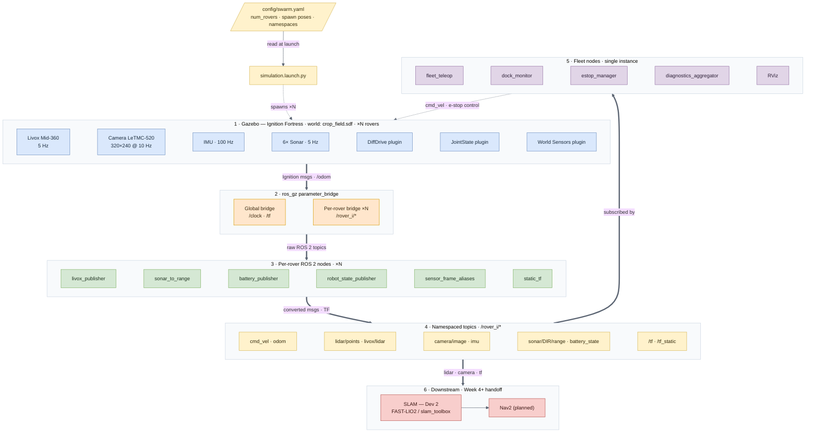

# Rover platform — system architecture

End-to-end data flow for the mesh rover swarm sim, numbered tier 1 → 6, from the physics
and sensor sim down to the fleet nodes and the Week 4+ SLAM handoff. Tiers 1–3 (Gazebo,
bridge, per-rover nodes) are spawned N times, one namespace `/rover_i` per rover, off a
single `config/swarm.yaml`. Read alongside `PARAMETER_CONFIG_GUIDE.md` (the values) and
`TOPIC_PARITY.md` (the sim-to-real topic contract).

## How to read it

- **Follow the numbers, 1 → 6, and the labels on each arrow.** The thick arrows are the
  spine of the data flow: sim → bridge → per-rover nodes → topics → downstream. The label
  on each says what crosses it (`Ignition msgs · /odom`, `raw ROS 2 topics`,
  `converted msgs · TF`, `lidar · camera · tf`).
- **Colors reinforce the tiers.** Blue = Gazebo sim, orange = ros_gz bridge, green =
  per-rover nodes, yellow = namespaced topics, purple = single fleet nodes, red =
  downstream consumers.
- **The control loop.** Fleet teleop and the e-stop feed back into the sim
  (`cmd_vel · e-stop control`, the dashed arrow), so `/rover_i/cmd_vel` reaches the
  DiffDrive plugin. Everything else flows one way, down the spine.
- **× N means replicated per rover.** Tiers 1–3 and the per-rover bridge are spawned once
  per rover at namespace `/rover_i`, set by `num_rovers` in `swarm.yaml` (the dashed
  `spawns × N` arrow from the launch file). The fleet nodes and the global bridge run once
  for the whole swarm.
- **`/tf` and `/clock` are deliberately shared, not namespaced:** sim time is one global
  clock and TF is one tree with per-rover prefixed frames (`rover_i/…`).
